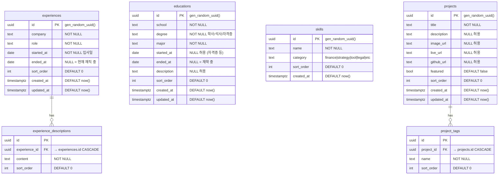

# Portfolio Database ERD

## 개요

포트폴리오 웹사이트의 학력, 경력, 스킬, 프로젝트 데이터를 저장하는 스키마입니다.

- **경력 설명(descriptions)** 은 별도 테이블로 분리하여 1:N 관계로 관리합니다.
- **프로젝트 태그(project_tags)** 도 별도 테이블로 분리합니다.
- `started_at` / `ended_at` 은 `date` 타입으로 저장하며, `ended_at IS NULL` 이면 현재 재직 중 또는 재학 중으로 간주합니다.
- 모든 테이블에 `sort_order` 컬럼을 두어 프론트엔드 표시 순서를 제어합니다.

---

## Mermaid ERD

---

## 컬럼 설명

### experiences (경력)
| 컬럼 | 타입 | 설명 |
|---|---|---|
| id | uuid | PK, 자동 생성 |
| company | text | 회사명 |
| role | text | 직함 |
| started_at | date | 입사일 (필수) |
| ended_at | date | 퇴사일 (NULL = 현재 재직 중) |
| sort_order | int | 화면 표시 순서 (낮을수록 먼저) |

### educations (학력)
| 컬럼 | 타입 | 설명 |
|---|---|---|
| id | uuid | PK, 자동 생성 |
| school | text | 학교/기관명 |
| degree | text | 학위 구분 (학사, 석사, 자격증 등) |
| major | text | 전공/과정명 |
| started_at | date | 입학일 (자격증은 NULL 가능) |
| ended_at | date | 졸업/취득일 (NULL = 재학 중) |
| description | text | 부가 설명 |
| sort_order | int | 화면 표시 순서 |

---

## 관련 파일

- 스키마 정의: [`drizzle/schema.ts`](../../drizzle/schema.ts)
- SQL 마이그레이션: [`docs/db/migrations/`](./migrations/)
- Drizzle 설정: [`drizzle.config.ts`](../../drizzle.config.ts)
